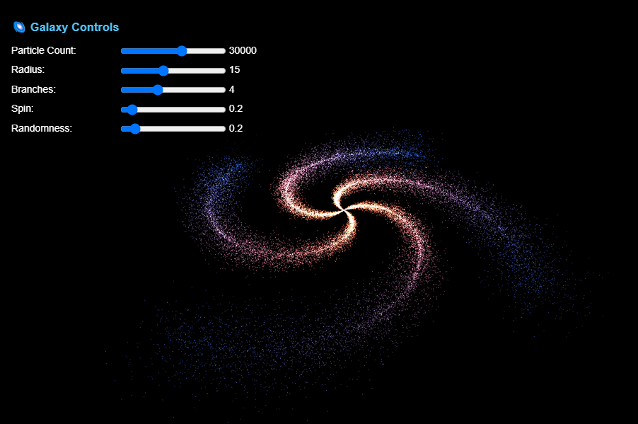
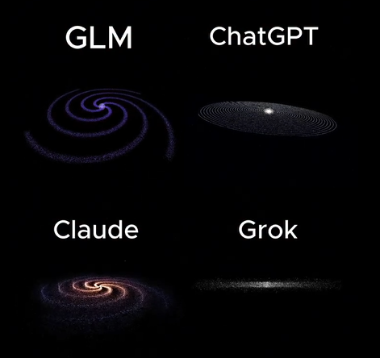

# 🌌 Galaxy Particle Simulator

An interactive 3D spiral galaxy visualization built with Three.js, generated entirely by **Claude Sonnet 4.5** from a single prompt.


## 🤖 The Story Behind This Project

This project was inspired by a Telegram post in the [AI_DeepMind channel](https://t.me/AI_DeepMind/3950) that challenged various AI models (GLM, ChatGPT, Grok, Claude) with a simple prompt:

> **Prompt:** "In one HTML file create a galaxy of thousands of tiny particles using Three.js."

This repository contains the output generated by **Claude Sonnet 4.5** using that exact prompt - a fully functional, interactive galaxy simulator in a single HTML file.

## 📸 Demo

### 🌐 Live Demo

**Try it now!** Visit the live demo on GitHub Pages:
👉 **[https://mehdeh.github.io/galaxy-particle-simulator/](https://mehdeh.github.io/galaxy-particle-simulator/)**

### Screenshots


*Galaxy simulator generated by Claude Sonnet 4.5*


*Comparison screenshot from the original Telegram challenge showing outputs from multiple AI models*

### Video Demo

Check out the [demo video](demo-video.mp4) to see the galaxy simulator in action!

## ✨ Features

- **Real-time Rendering**: Smooth 60 FPS animation with automatic galaxy rotation
- **Interactive Controls**: Adjust galaxy parameters dynamically with intuitive sliders
- **Mouse Interaction**: Camera follows mouse movement for immersive exploration
- **Procedural Generation**: Each configuration creates unique galaxy formations
- **Responsive Design**: Automatically adapts to different screen sizes
- **Performance Optimized**: Handles up to 50,000 particles efficiently

## 🚀 Getting Started

### Prerequisites

- A modern web browser (Chrome, Firefox, Safari, or Edge)
- No additional dependencies required!

### Installation

1. Clone the repository:
```bash
git clone https://github.com/yourusername/galaxy-particle-simulator.git
cd galaxy-particle-simulator
```

2. Open the HTML file:
```bash
# Using Python
python -m http.server 8000

# Or using Node.js
npx http-server

# Or simply open the file directly
open index.html
```

3. Navigate to `http://localhost:8000/` in your browser (if using a local server)

**Or simply visit the live demo:** [https://mehdeh.github.io/galaxy-particle-simulator/](https://mehdeh.github.io/galaxy-particle-simulator/)

## 🎮 Usage

Simply open `index.html` in your web browser (or visit the [live demo](https://mehdeh.github.io/galaxy-particle-simulator/)) to start the simulation. Use the control panel on the left to customize your galaxy!

### Interactive Controls

| Control | Range | Description |
|---------|-------|-------------|
| **Particle Count** | 1,000 - 50,000 | Number of stars in the galaxy |
| **Radius** | 5 - 30 | Size of the galaxy |
| **Branches** | 2 - 8 | Number of spiral arms |
| **Spin** | 0 - 3 | Spiral intensity and tightness |
| **Randomness** | 0 - 2 | Scatter and dispersion of particles |

### Mouse Controls

- **Move Mouse**: Camera position follows cursor for dynamic viewing angles
- The galaxy automatically rotates for a cinematic effect

## 🛠️ Technologies

- **Three.js r128**: 3D graphics library
- **WebGL**: Hardware-accelerated rendering
- **JavaScript ES6**: Core logic and interactivity
- **HTML5 & CSS3**: Structure and styling

## 🎨 Customization

You can customize the galaxy appearance by modifying these parameters in the code:

```javascript
const parameters = {
    count: 15000,           // Number of particles
    size: 0.02,             // Size of each particle
    radius: 15,             // Galaxy radius
    branches: 4,            // Number of spiral arms
    spin: 1,                // Spiral intensity
    randomness: 0.5,        // Particle dispersion
    randomnessPower: 3,     // Randomness distribution curve
    insideColor: '#ff6030', // Color at galaxy center
    outsideColor: '#1b3984' // Color at galaxy edge
};
```

## 🌟 Features Explained

### Particle System
The simulator uses Three.js `BufferGeometry` and `PointsMaterial` for efficient rendering of thousands of particles. Each particle represents a star with position and color calculated procedurally.

### Color Gradient
Stars transition from warm orange-red tones at the galaxy center to cool blue tones at the outer edges, mimicking real galactic color distribution.

### Spiral Formation
The spiral arms are generated using polar coordinates with a spin factor that creates the characteristic spiral shape of disk galaxies.

### Randomness Algorithm
Particles are distributed using a power function (`Math.pow`) to create realistic clustering near the spiral arms while maintaining some scatter.

## 📝 License & Attribution

This project is **free and open source**. The code was generated by **Claude Sonnet 4.5** (Anthropic) and is provided as-is for educational and demonstration purposes.

- **Code Author**: Claude Sonnet 4.5 (AI)
- **Repository Maintainer**: Created for the AI coding challenge comparison
- **License**: Public Domain / MIT - Feel free to use, modify, and distribute

## 🙏 Acknowledgments

- Inspired by the [AI_DeepMind Telegram channel](https://t.me/AI_DeepMind/3950) AI coding challenge
- Generated by Claude Sonnet 4.5 from Anthropic
- Built with [Three.js](https://threejs.org/)
- Demonstrates the capabilities of modern AI code generation

---

**Generated by AI, Powered by JavaScript** 🤖✨

*Explore the cosmos from your browser!* 🚀🌌

